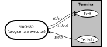

*Input/Output*
**************

Modelo de *Input/Output* na linguagem C
=======================================

Modelo de ficheiros
-------------------

Ao mais baixo nível, um ficheiro é uma sequência de valores numéricos representados a 8 *bit*
-- é uma sequência de *bytes*.

.. figure:: modelo_ficheiro3.svg
   :align: center

|

**Ficheiro de texto**

Quando esses valores numéricos são interpretados como códigos de caracteres,
diz-se que é um ficheiro de texto.

Considere-se o ficheiro de texto ``afile.txt``: ::

   $ cat afile.txt
   bom dia
   abcd 1234
   PSC-25/26v

Um ficheiro de texto é modelado como uma sequência de linhas de texto.
Uma linha de texto é formada por uma sequência de caracteres terminada pela marcação de fim de linha.
Esta marcação é representada na linguagem C por ``'\n'``.

O utilitário hexdump permite uma visualização binária do ficheiro.
Nos sistemas da família UNIX as marcações de fim de linha ``'\n'``
são representadas pelo caractere Line Feed (LF) com valor numérico 0x0a: ::

   $ hexdump -C afile.txt
   00000000  62 6f 6d 20 64 69 61 0a  61 62 63 64 20 31 32 33  |bom dia.abcd 123|
   00000010  34 0a 50 53 43 2d 32 35  2f 32 36 76 0a           |4.PSC-25/26v.|
   0000001d

..	Mostrar aqui o conteúdo de um ficheiro com a ferramenta hexdump

**Modelo de acesso a ficheiro**

.. figure:: modelo_ficheiro4.svg
   :align: center
   :scale: 120

O conteúdo de um ficheiro pode ser interpretado em modo texto ou em modo binário.
Em modo binário o conteúdo é encarado como uma sequência de *bytes* indiferenciados.
Em modo texto é encarado como uma sequência de linhas de texto,
em que cada linha é formada por uma sequência de caracteres imprimíveis
e terminadas por um marcador de fim de linha.
No Unix o marcador é o caractere LF (*line feed*),
no Windows o marcador é a sequência CR-LF (*carriage return*-*line feed*).

Todos os ficheiros, incluindo os que contêm texto, podem ser interpretados em modo binário.

As transferências de dados entre a memória e o ficheiro
processam-se a partir de um indicador de posição associado ao ficheiro (*file pointer*).
O indicador de posição avança automaticamente após cada operação de transferência
de um número igual ao número de *bytes* transferidos.

Na operação de abertura, o indicador de posição é colocado no início (opções ``r`` e ``w``)
ou para além do fim (opção ``a``).

Existem funções para modificar o indicador de posição de um ficheiro aberto.

**Suportes físicos**

Os dispositivos físicos a considerar para suporte a ficheiros são:
ecrã, teclado e ficheiros em disco.
Este dispositivos são representados na linguagem C
por variáveis do tipo ponteiro para FILE (*file descriptor*).

Num programa em linguagem C, existem disponíveis três destas variáveis
definidas na biblioteca normalizada, que representam o teclado e o ecrã. ::

   FILE *stdin = &struct_stdin;
   FILE *stdout = &struct_stdout;
   FILE *stderr = &struct_stderr;

No ecrã, a escrita do caractere ``\n`` provoca o posicionamento do cursor no início da linha seguinte.
No teclado, a tecla ENTER produz o carácter \n.

Acesso em modo texto
--------------------

Output
......

A escrita é realizada no dispositivo representado pelo parâmetro ``stream``.
Se for ``stdout`` ou ``stderr`` será no ecrã.

A função ``fputs`` escreve a *string* indicada por ``s``
e acrescenta o caractere ``\n``, o que provoca uma mudança de linha. ::

   int fputs(const char *s, FILE *stream);

A funçãp ``fprintf`` escreve o texto indicada em ``format``,
substituindo os campos de formatação **%** pela representação dos valores passados nos restantes argumentos. ::

   int fprintf(FILE *stream, const char *format, ...);

A função ``fputc`` escreve um carácter. ::

   int fputc(int c, FILE *stream);

As três funções seguintes equivalem às anteriores com ``stdout`` como argumento no parâmetro ``stream``. ::

	int puts(const char *s);
	int printf(const char *format, ...);
	int putchar(int c);

A função ``fflush`` atualiza o dispositivo físico com os dados em armazenamento intermédio,
resultantes de operações de escrita anteriores. ::

   int	fflush(FILE *stream);

Especificações de conversão das funções da família **printf**:

%<flags><width><.precision><lenght><conversion>

=========== ==============================================================
flags       **\+** imprime o sinal), **-** ajuste à esquerda,
            **0** preencher com zeros, **#** modo de escrita alternativo
with        dimensão mínima do campo
.precision  dimensão máxima para uma *string* ou casas decimais
length      **h** short, **l** long, **z** size_t, **L** long double .
conversion  b, d, i, o, u, x, c, s, f, e, a, g, p, n
=========== ==============================================================

Input
.....

A leitura é realizada do dispositivo indicado no parâmetro ``stream``.
Se for ``stdin`` será do teclado.

A função ``fgets`` lê uma linha de texto.
Espera pelo terminador de linha (\\n).
O parâmetro ``n`` indica a dimensão da memória indicada por ``s`` disponível para receber o texto. ::

   char *fgets(char *s, int n, FILE *stream);

A função ``fscanf`` aplica a conversão de texto indicada em ``format``
à medida que lê os caracteres do dispositivo representado por ``stream``. ::

  int fscanf(FILE *stream, const char *format, ... );

Especificações de conversão das funções da família  **scanf**: ::

%*<width><lenght><conversion>

============ =============================================
\*            interpreta o campo sem afetar a variável
width        dimensão máxima do campo
length       **h** short, **l** long, **L** long double
conversion   b, d, i, o, x, u, c, s, a, f, e, g
============ =============================================

A função ``fgetc`` lê um carácter do dispositivo representado por ``stream``. ::

   int fgetc(FILE *stream);

As três funções seguintes equivalem às anteriores com ``stdin`` como argumento no parâmetro ``stream``.
(A função ``gets`` foi retirada da biblioteca normalizada
por segurança, devido não se poder controlar a escita na memória indicada por ``s``.) ::

   char *gets(char *s);
   int scanf(const char *format, ...);
   int getchar();

Exemplo
.......

A função ``read_word`` lê palavras do *stream* indicado no parâmetro ``fd``.
Uma palavra é uma sequência de caracteres que não pertençam
ao conjunto dos caracteres delimitadores passado no parâmetro ``separators``.
A função ``read_word`` utiliza a função ``fgetc`` para obter os sucessivos caracteres do ficheiro.
A sua programação tem um primeiro estado em que ignora todos os caracteres delimitadores (linhas 9 a 15)
e um segundo estado em que recolhe todos os caracteres até ao próximo delimitador (linhas 16 a 27).

Durante os dois estados verifica a terminação do ficheiro, caso em que interrompe o processamento e retorna -1.
No segundo estado verifica também, através do parâmetro ``buffer_size``,
a dimensão disponível do *array* ``buffer`` para armazaneamento dos caracteres.
Se esgotar, retorna -2.
Em qualquer dos casos o *array* ``buffer`` recebe sempre uma *string* válida.

.. literalinclude:: ../../../code/input_output/read_word.c
   :language: c
   :linenos:
   :lines: 4-
   :caption: Ler uma palavra de um ficheiro de texto

Redirecionamento
----------------

As variáveis ``stdin`` e ``stdout`` que representam normalmente o teclado e o ecrã
podem representar ficheiros em disco.
Essa substituição pode ser feita na invocação do programa na linha de comando do interpretador de comandos.

O sinal **>** substitui, em ``stdout``, o *file descriptor* do ecrã pelo do ficheiro que se indicar.
O sinal **<** substitui, em ``stdin``, o *file descriptor* do teclado pelo do ficheiro que se indicar.

Exemplos
........

::

   $ program < myfile

O programa ``program`` ao ler de ``stdin``, está efectivamente a ler do ficheiro ``myfile``.

::

   $ program2 < text1 > text2

O programa ``program2`` lê de ``text1`` e escreve em ``text2``,
ao usar, respectivamente, os ponteiros ``stdin`` e ``stdout``.

Controlo de ficheiros
---------------------

Para que as funções anteriores acedam a um dado ficheiro em disco é necessário
que o argumento passado no parâmetro ``stream`` esteja associado a esse ficheiro.
Essa associação é realizada pela função ``fopen``. (Designa-se por abertura do ficheiro.) ::

  FILE *fopen(const char *filename, const char *mode);

Esta função procura, no sistema de ficheiros,
pelo ficheiro indicado no parâmetro ``filename``,
e cria uma representação interna desse ficheiro numa *struct* do tipo ``FILE``.

Modos de abertura do ficheiro: **\"r\"** - só ler; **\"w\"** - só escrever; **\"a\"** - escrever no fim .
Sinal **\+** significa abrir em modo atualização; **\"r+\"** - ler e escrever;
**\"w+\"** - ler e escrever começa vazio; **\"a+\"** escrever no fim e ler em qualquer lado.

Quando um ficheiro é aberto em modo de atualização deve-se usar
``fflush``, ``fseek``, ``fsetpos`` entre as escritas e as leituras para posicionar o indicador de posição.

A função ``fclose`` garante a atualização do ficheiro no sistema de ficheiros com eventuais dados em trânsito,
e elimina a representação interna do ficheiro.
A partir desse momento o ficheiro deixa de estar acessível.
Ao terminar um processo, o sistema operativo executa esta função para todos os ficheiros abertos. ::

   int fclose(FILE * stream);

A função ``remove`` serve para eliminar um ficheiro. ::

   int remove(const char *filename);

A função ``rename`` permite alterar o nome de um ficheiro. ::

   int rename(const char *oldname, const char *newname);

A função ``tmpfile`` cria um ficheiro temporário anónimo.
A função ``fclose`` elimina-o do sistema de ficheiros. ::

  FILE *tmpfile(void);

A função ``tmpnam`` cria um nome de ficheiro diferente de qualquer outro existente no sistema de ficheiros. ::

   char *tmpnam(char S[L_tmpnam]);

Posicionamento
--------------

As funções seguintes permitem manipular o indicador de posição. ::

   int fseek(FILE *stream, long offset, int whence);

======== ========================================
SEEK_SET posiciona na posição indicada
SEEK_CUR posiciona em relação à posição corrente
SEEK_END posiciona em relação ao fim
======== ========================================

::

   long ftell(FILE *stream);
   int fsetpos(FILE *stream, const fpos_t *pos);
   int fgetpos(FILE *restrict stream, fpos_t *restrict pos);

   void rewind(FILE * stream);

Acesso em modo binário
------------

Em modo binário, um ficheiro é encarado como uma sequência de *bytes*.

Output
......

Escrever no ficheiro representado por `stream`,
uma sequência de **items** com dimensão ``nitens``,
tendo cada **item** a dimensão ``size`` em *bytes*.
Esta operação escreve no ficheiro um bloco de *bytes*,
com a dimensão ``nitens * size`` *bytes* para a memória indicada por ``ptr``. ::

   size_t fwrite(const void *ptr, size_t size, size_t nitems, FILE *stream);

   int fputc(int c, FILE *stream);

Input
.....

Ler do ficheiro representado por ``stream``, uma sequência de *items* com dimensão ``nitens``,
tendo cada *item* a dimensão ``size`` em *bytes*.
Esta operação lê um bloco com a dimensão ``nitens * size`` *bytes* para a memória indicada por  ``ptr``. ::

   size_t fread(void * ptr, size_t size, size_t nitems, FILE * stream);

   int fgetc(FILE *stream);

A função ``ungetch`` recua de uma posição o indicador de posição do ficheiro
e insere o valor do parâmetro ``c`` nessa posição.
Útil na programação de interpretadores. ::

   int ungetc(int c, FILE *stream);

Exemplo
.......

Programa para mostrar no terminal o conteúdo de um ficheiro em hexadecimal
(semelhante a ``$ hexdump -C <file>``).

.. literalinclude:: ../../../code/input_output/hexdump.c
   :language: c
   :linenos:

Erros
-----

Em todas as funções é retornada a indicação sobre eventual ocorrência de erro.
Essa indicação, do tipo “sim ou não”, é indicada na forma de um ponteiro NULL
ou de um valor negativo.

Essa indicação "sim ou não" pode ser obtida posteriormente com ::

   int ferror(FILE *stream);

ou obtida uma informação mais precisa através da variável ``errno``.

A função ``perror`` imprime, em ``stderr``,
uma mensagem descritiva do erro registado em ``errno``. ::

   void perror(const char *str);

A função ``clearerr`` elimina a indicação de erro ocorrido em operação anterior. ::

   void clearerr(FILE * stream);

A função ``feof`` informa se foi tentado aceder para além do fim do ficheiro. ::

   int feof(FILE *stream);

A função ``strerror`` traduz um código de erro para texto descritivo. ::

   char * strerror(int errnum);

Exercícios
----------
   1. Fazer uma programa para copiar ficheiros. Primeira versão - caractere a caractere; segunda versão - bloco a bloco.
   2. Fazer um programa para concatenar ficheiros.
   3. Fazer um programa para ordenar um ficheiro de texto pela ordem alfabética da linhas.

Referências
-----------

The C Programming Language - Chapter 7 - Input and Output

Norma da linguagem C - ISO/IEC 9899:2023 (draft `N3096 <https://www9.open-std.org/JTC1/SC22/WG14/www/docs/n3096.pdf>`_)

`C reference <https://en.cppreference.com/w/c>`_

`Wikipedia - C file input/output <https://en.wikipedia.org/wiki/C_file_input/output>`_